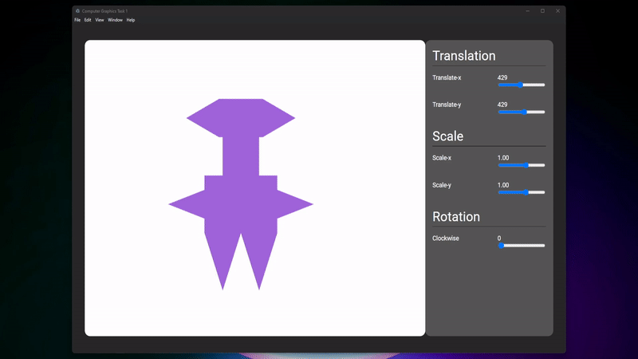

# Computer Graphics Programming Task 1

## Table of contents:
- [Description](#Description)
- [Quick Preview](#quick-preview)
- [How to Run The Project](#run-the-project)
- [Team](#team)


### Description

Simple Desktop Application made with ElectronJS, WebGL, Vanilla JavaScript, HTML & CSS to show computer graphics concepts
like translation, rotation in both XY axes, scaling in both XY axes, and rotation around a point.

We used WebGL's shaders (vertex shader & fragment shader) and functions to draw the shapes and apply the transformations.


### Quick Preview


### How to Run The Project
1- Install NodeJS on your PC
``` 
Download it from nodejs.org/en/download/
```

2- Install Required node modules

```shell
npm install
```

3- Run Electron Project

```shell
npm start
```


### Team
First Semester - Computer Graphics & Biomedical Visualization (SBE3130) class task created by:

| Team Members                                          |
|-------------------------------------------------------|
| [Ibrahim Mohamed](https://github.com/1brahimmohamed)  |
| [Abdelrahman Yaser](https://github.com/Abdelrhman012) |
| [Mahmoud Yasser](https://github.com/mahmoud1yaser)    |


### Submitted to:
- Eng. Samar Taher,
  All rights reserved © 2022 to Team 14 - Systems & Biomedical Engineering, Cairo University (Class 2024)